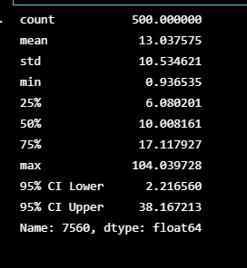

# Challenge5

**Summary**

In this excercise we are asked to determine if the coustomer has enough savings to retire early. From the data as well as the monte carlo simulation, the coustomer will only have enough money if they invest there current funds for 30 years. 

This conclusion has been drawn by running the 30 years as well as the 10 year monete carlo simulations. 

**Results**

Below are the summary statics of of the two monte carlo simulation.

**Conclusion**

In conclusion the coustomer needs to be invested for 30 years in order to retire with enough funds to retire.

